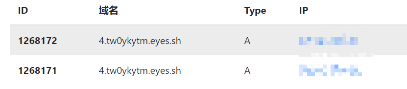
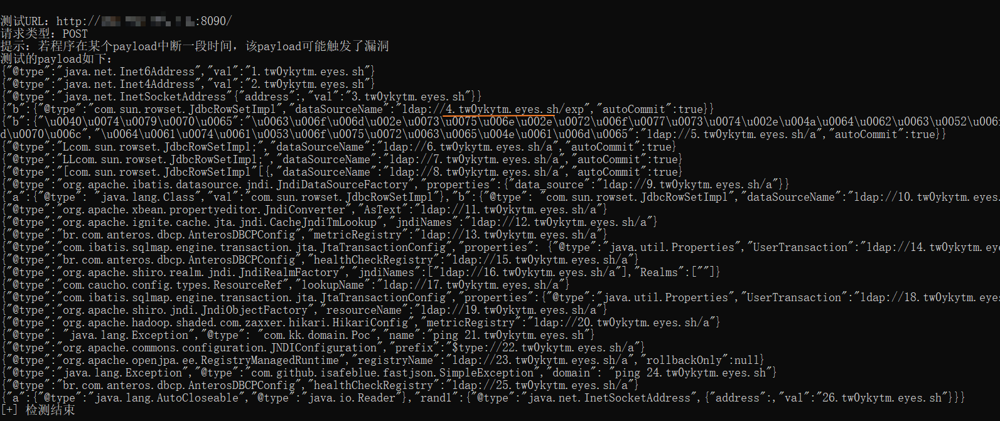
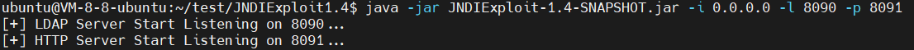
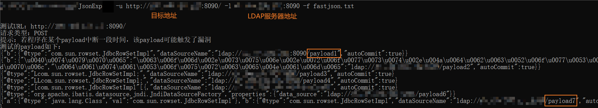
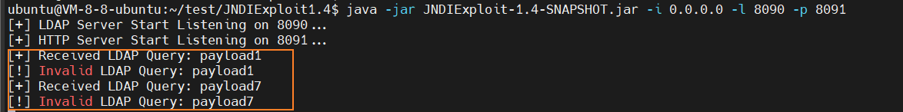

## 简介

**作者：** 小狐狸FM

**项目：** https://github.com/smallfox233/JsonExp

**版本：** 1.1

```
1. 根据现有payload，检测目标是否存在fastjson或jackson漏洞（工具仅用于检测漏洞）
2. 若存在漏洞，可根据对应payload进行后渗透利用
3. 若出现新的漏洞时，可将最新的payload新增至txt中（需修改格式）
```

## 使用

| 参数 | 别名     | 作用                | 例子                                |
| ---- | -------- | ------------------- | ----------------------------------- |
| -u   | --url    | 指定目标url         | -u http://www.test.com              |
| -f   | --file   | 指定payload文本路径 | -f fastjson.txt                     |
| -t   | --type   | 指定HTTP请求类型    | -t get                              |
| -l   | --ldap   | 指定ldap地址        | -l xxx.xxx.xxx:8080                 |
| -r   | --rmi    | 指定rmi地址         | -r xxx.xxx.xxx:8080                 |
| -c   | --cookie | 指定cookie值        | --cookie "name=xxx;sessionid=xxxxx" |

命令

```
JsonExp -u [目标] -l [LDAP服务地址]  -f fastjson.txt
```

### DNSlog检测


若出现dnslog回弹，可根据前面的编号去寻找对应的payload

```
编号.地址
```






### LDAP检测

若为**内网环境**/**目标无法DNS解析**时，可使用工具https://github.com/WhiteHSBG/JNDIExploit在**本地/云服务器**起一个LDAP服务


将**域名**换成**IP:端口**即可（上图中使用的是8090作为LDAP服务端口）



此时LDAP服务器可收到**路径**信息，可根据路径信息来定位触发漏洞的payload



### Payload介绍

**格式：** `{.........$type$://$ip$/路径....}#注释内容`

```
$type$	用于指定ldap或rmi服务类型
$ip$	用于指定ldap地址或rmi地址
路径	   若LDAP服务器地址为IP时，需要通过不同的路径来定位触发漏洞的payload
```


**注意事项：**

```
1. 每行分为两个部分，一个是漏洞利用的payload，另一个部分是注释
2. payload必须写在注释的前面
3. 注释符#及其之后的内容，将会在检测时被忽略
4. 若payload为多行，则需将其中的换行符删去，保证一个payload占据一行
```


