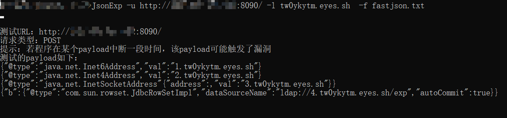
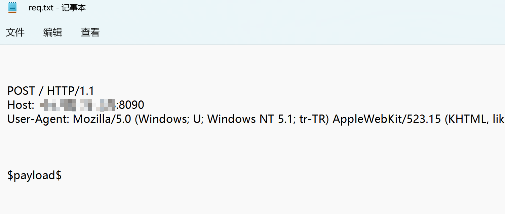
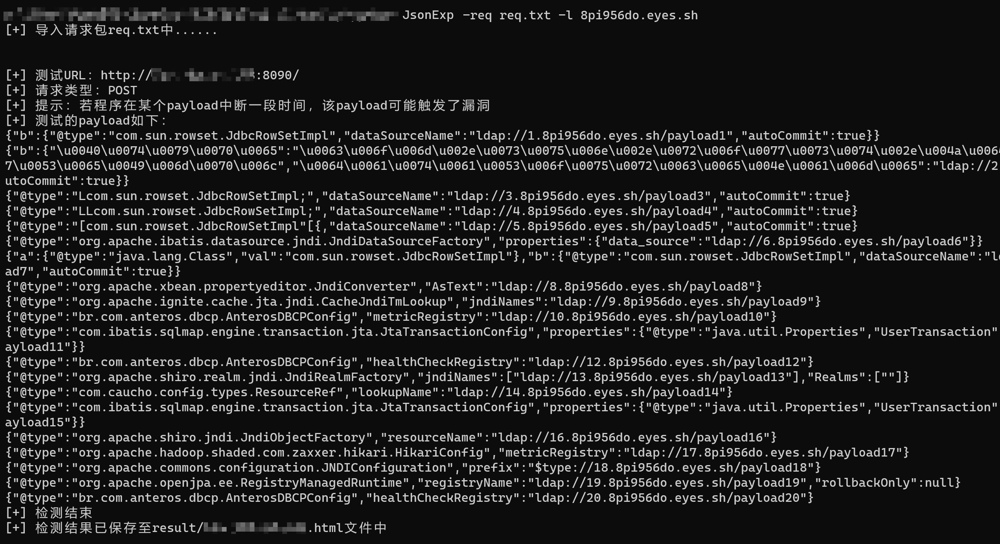
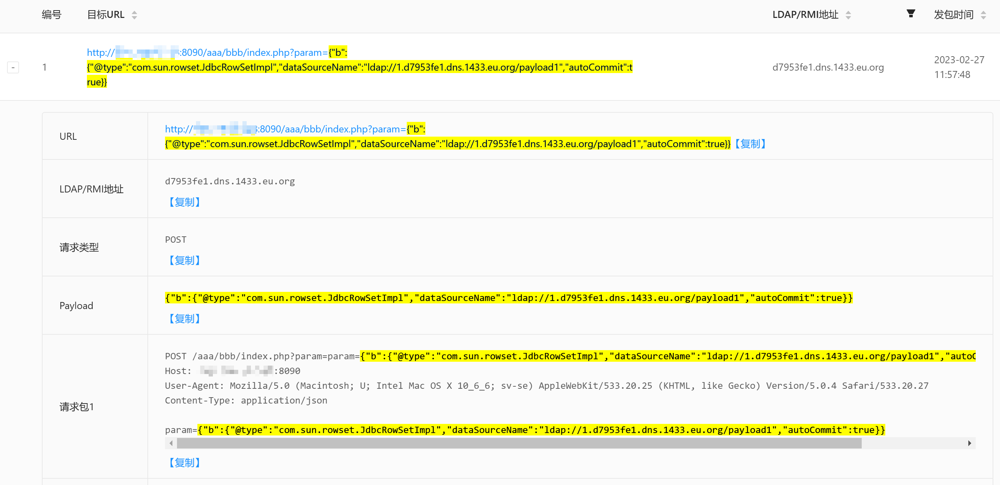
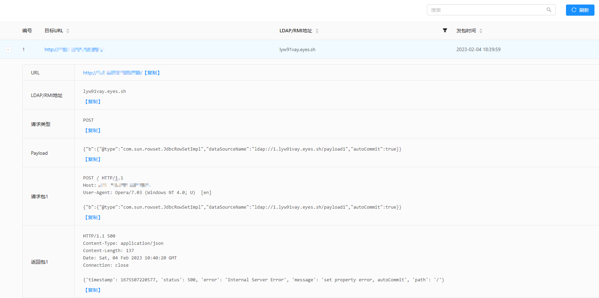
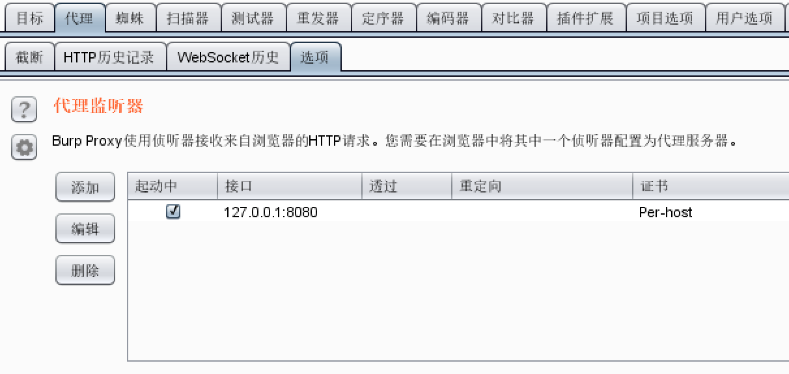
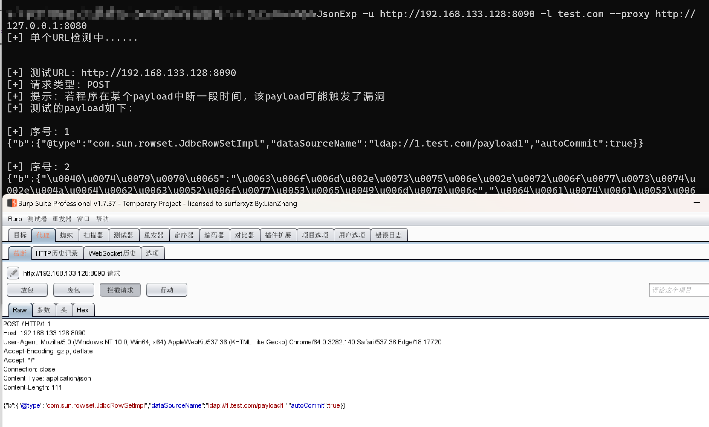

## 简介


**作者：** 小狐狸FM

**项目：** https://github.com/smallfox233/JsonExp

**版本：** 1.3.6

```
1. 根据现有payload，检测目标是否存在fastjson或jackson漏洞（工具仅用于检测漏洞）
2. 若存在漏洞，可根据对应payload进行后渗透利用
3. 若出现新的漏洞时，可将最新的payload新增至txt中（需修改格式）
4. 工具无法完全替代手工检测，仅作为辅助工具使用
```

## 使用

| 参数   | 别名       | 作用                                                       | 例子                                |
| ------ | ---------- | ---------------------------------------------------------- | ----------------------------------- |
| -u     | --url      | 指定目标url                                                | -u http://www.test.com              |
| -uf    | --urlfile  | 指定目标url文档，每行一个url                               | -uf url.txt                         |
| -req   | --request  | 指定请求包                                                 | -req request.txt                    |
| -to    | --timeout  | 指定请求超时时长，默认为5秒                                | -to 8                               |
| -f     | --file     | 指定payload文本路径，默认为template/fastjson.txt           | -f payload.txt                      |
| -t     | --type     | 指定HTTP请求类型，默认为post                               | -t get                              |
| -l     | --ldap     | 指定ldap地址                                               | -l xxx.xxx.xxx:8080                 |
| -r     | --rmi      | 指定rmi地址                                                | -r xxx.xxx.xxx:8080                 |
| -c     | --cookie   | 指定cookie值                                               | --cookie "name=xxx;sessionid=xxxxx" |
| -pro   | --protocol | 指定请求包所使用的协议，需结合-req参数使用，默认为http协议 | -req request.txt -pro https         |
| -proxy | --proxy    | 设置代理                                                   | --proxy http://127.0.0.1:8080       |

**windows系统**

```
在JsonExp.exe目录打开cmd界面

检测单个站点:
JsonExp -u [目标] -l [LDAP服务地址]

根据请求包检测单个站点：
JsonExp -req [目标.txt] -l [LDAP服务地址]

根据文本检测多个站点:
JsonExp -uf [目标.txt] -l [LDAP服务地址]
```

**Linux系统**

```
添加权限:
chmod +x JsonExp

检测单个站点:
./JsonExp -u [目标] -l [LDAP服务地址]

根据请求包检测单个站点：
./JsonExp -req [目标.txt] -l [LDAP服务地址]

根据文本检测多个站点:
./JsonExp -uf [目标.txt] -l [LDAP服务地址]
```

**Mac系统**

```
检测单个站点:
JsonExp -u [目标] -l [LDAP服务地址]

根据请求包检测单个站点：
JsonExp -req [目标.txt] -l [LDAP服务地址]

根据文本检测多个站点:
JsonExp -uf [目标.txt] -l [LDAP服务地址]
```


### DNSlog检测



若出现dnslog回弹，可根据前面的编号去寻找对应的payload

```
编号.地址
```


### LDAP检测

若为**内网环境**/**目标无法DNS解析**时，可使用工具在**本地/云服务器**起一个LDAP服务

https://github.com/WhiteHSBG/JNDIExploit


将**域名**换成**IP:端口**即可（上图中使用的是8090作为LDAP服务端口）


此时LDAP服务器可收到**路径**信息，可根据路径信息来定位触发漏洞的payload


### 请求包检测

若使用`-req`参数进行检测时，需要设置需要检测的变量值位置

将请求中需要检测的位置替换为`$payload$`，其余位置不变，保存为req.txt（文件名任意）

**格式：**

```json
POST /xxx HTTP/1.1
Host: xxx

$payload$
```

然后通过`-req`指定该文件，根据请求包进行漏洞检测

```
JsonExp -req req.txt -l xxx.xxx.xxx
```

**示例：**







**注意：**

```
1. $payload$必须英文小写
2. 若$payload$指定多个位置时仍可检测漏洞，但无法定位具体的漏洞参数
3. 若$payload$设置在请求头中，将无法检测
4. 一个文件仅限一个请求包，出现多个请求包时将会出错
5. 发送时默认采用http协议，若请求包为https协议，需使用-pro https来指定协议类型
```


### Payload介绍

默认的payload保存在template文件夹下

**格式：** `{.........$type$://$ip$/路径....}#注释内容`

```
$type$	用于指定ldap或rmi服务类型（必须小写）
$ip$	用于指定ldap地址或rmi地址（必须小写）
路径	若LDAP服务器地址为IP时，需要通过不同的路径来定位触发漏洞的payload
```

**注意：**

```
1. 每行分为两个部分，一个是漏洞利用的payload，另一个部分是注释
2. payload必须写在注释的前面
3. 注释符#及其之后的内容，将会在检测时被忽略
4. 若payload为多行，则需将其中的换行符删去，保证一个payload占据一行
5. $type$和$ip$必须英文小写
```

### 结果展示功能

输出结果参考自`xray`，模板路径为`template/report.html`，请勿删除该文件

执行程序后，将会在`result`目录下生成`域名.html`或`ip.html`文件



### 代理设置

使用`--proxy`设置代理，可用于调试信息、绕waf等操作

```shell
--proxy http://127.0.0.1:8080
```

burpsuite中设置代理



将工具的流量代理到burpsuite中（此工具不能适应所有的情况，可通过该方式对payload进行适当调整）


